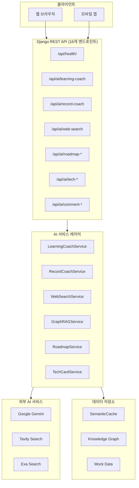

# Jagalchi AI Server - 종합 API 문서

> 📅 테스트 일시: 2025-12-22 22:43 KST  
> 🐳 환경: Docker Container (python:3.11-slim)  
> ✅ 전체 16개 API 테스트 완료

---

## 📐 시스템 아키텍처



---

## 🏗 모듈 구조

```
jagalchi_ai/
├── ai_core/
│   ├── client/                    # 외부 API 클라이언트
│   │   ├── gemini_client.py       # Google Gemini API
│   │   ├── tavily_client.py       # Tavily 웹 검색
│   │   └── exa_client.py          # Exa 시맨틱 검색
│   │
│   ├── controller/                # API 컨트롤러
│   │   ├── ai_views.py            # 16개 API 엔드포인트
│   │   └── serializers.py         # 응답 시리얼라이저
│   │
│   ├── service/                   # 비즈니스 로직
│   │   ├── coach/                 # 학습 코치
│   │   │   ├── learning_coach.py  # ReAct 패턴 학습 코치
│   │   │   ├── behavior_model.py  # Fogg B=MAP 행동 모델
│   │   │   └── simple_workflow.py # LangGraph 스타일 워크플로우
│   │   ├── graph/                 # GraphRAG
│   │   ├── tech/                  # 기술 카드
│   │   ├── retrieval/             # 검색 서비스
│   │   └── analytics/             # 패턴 분석
│   │
│   └── repository/                # 데이터 접근
│       └── mock_data.py           # 목 데이터
│
└── urls.py                        # URL 라우팅
```

---

## 🔌 전체 API 테스트 결과

### 1. Health Check API
```bash
GET /api/health/
```
**응답:**
```json
{
    "status": "ok",
    "version": "1.0.0",
    "services": {
        "gemini": true,
        "tavily": true,
        "exa": true,
        "graph_rag": true,
        "semantic_cache": true
    },
    "timestamp": "2025-12-22T13:41:27.557208"
}
```

---

### 2. Record Coach API (학습 기록 AI 피드백)
```bash
GET /api/ai/record-coach?roadmap_id=rm_frontend
```
**응답:**
```json
{
    "record_id": "rec1",
    "model_version": "rule-based",
    "scores": {
        "evidence_level": 3,
        "structure_score": 75,
        "specificity_score": 0,
        "reproducibility_score": 100,
        "quality_score": 68
    },
    "strengths": [
        "링크 기반 근거가 있어 신뢰도가 높다",
        "목표/문제/해결 구조가 일정 부분 보인다",
        "재현 가능한 링크가 포함되어 있다"
    ],
    "gaps": ["구체적인 수치나 에러 메시지가 부족하다"],
    "next_actions": [
        {"effort": "2h", "task": "에러 로그/수치 기록 및 원인 분석 추가"}
    ]
}
```

---

### 3. Learning Coach API (학습 코치)
```bash
GET /api/ai/learning-coach?question=React%20학습방법&user_id=user_1
```
**응답:**
```json
{
    "user_id": "user_1",
    "question": "React 학습방법",
    "intent": "concept",
    "toolchain": ["graph_explorer"],
    "plan": ["route", "retrieve", "compose"],
    "answer": "핵심 개념 요약: HTML 구조, CSS 레이아웃, 상태관리 redux zustand",
    "behavior_summary": {
        "motivation": 0.17,
        "ability": 0.8,
        "prompt_hour": 13,
        "dropout_risk": 0.0117
    },
    "cache_hit": false
}
```

---

### 4. Learning Pattern API
```bash
GET /api/ai/learning-pattern?user_id=user_1
```
**응답:**
```json
{
    "user_id": "user_1",
    "period": "last_30d",
    "patterns": {
        "active_days": 5,
        "avg_session_gap_days": 0.75,
        "completion_velocity": 0.133
    },
    "recommendations": ["현재 학습 패턴이 안정적입니다. 난이도를 조금 올려보세요"]
}
```

---

### 5. Related Roadmaps API
```bash
GET /api/ai/related-roadmaps?roadmap_id=rm_frontend
```
**응답:**
```json
{
    "roadmap_id": "rm_frontend",
    "candidates": [
        {"related_roadmap_id": "rm_react", "score": 1.0},
        {"related_roadmap_id": "rm_backend", "score": 0.5271}
    ]
}
```

---

### 6. Roadmap Generated API
```bash
GET /api/ai/roadmap-generated?goal=백엔드개발자
```
**응답:**
```json
{
    "roadmap_id": "generated",
    "title": "백엔드개발자 로드맵",
    "nodes": [
        {"node_id": "node_html", "title": "HTML 구조"},
        {"node_id": "node_css", "title": "CSS 레이아웃"},
        {"node_id": "node_js", "title": "JavaScript 기초"},
        {"node_id": "node_api", "title": "REST API"},
        {"node_id": "node_db", "title": "Database"},
        {"node_id": "node_hooks", "title": "Hooks"}
    ]
}
```

---

### 7. Roadmap Recommendation API
```bash
GET /api/ai/roadmap-recommendation?target_role=frontend_dev
```
**응답:**
```json
{
    "roadmap_id": "roadmap:frontend_dev",
    "nodes": [
        {"node_id": "node_html", "status": "COMPLETED"},
        {"node_id": "node_css", "status": "AVAILABLE"},
        {"node_id": "node_js", "status": "AVAILABLE"}
    ],
    "gnn_predictions": {
        "node_html": ["node_css"],
        "node_css": ["node_js"]
    }
}
```

---

### 8. Tech Cards API
```bash
GET /api/ai/tech-cards?tech_slug=react
```
**응답 (요약):**
```json
{
    "name": "react",
    "category": "tech",
    "summary": "Bridge to React 19 - All new bundling, server rendering...",
    "why_it_matters": ["업계 표준에 가까운 사용 사례를 확보할 수 있다"],
    "when_to_use": ["UI/서비스의 구조를 빠르게 확장해야 할 때"],
    "alternatives": [{"slug": "vue", "why": "학습 난이도가 낮고 템플릿 기반"}],
    "pitfalls": ["의존성 배열을 누락해 무한 렌더가 발생하는 케이스가 많다"]
}
```

---

### 9. Tech Fingerprint API
```bash
GET /api/ai/tech-fingerprint?roadmap_id=rm_frontend
```
**응답:**
```json
{
    "roadmap_id": "rm_frontend",
    "tags": [],
    "model_version": "tagger_v1"
}
```

---

### 10. Comment Digest API
```bash
GET /api/ai/comment-digest?roadmap_id=rm_frontend
```
**응답:**
```json
{
    "roadmap_id": "rm_frontend",
    "period": "last_14d",
    "highlights": [
        "useEffect에서 의존성 배열을 비우면 렌더가 반복돼요",
        "JS async/await 에러 처리를 어떻게 정리하나요?"
    ],
    "bottlenecks": [{"node_id": "node_js", "score": 1.0, "top_topics": ["질문 빈도 증가"]}]
}
```

---

### 11. Comment Duplicates API
```bash
GET /api/ai/comment-duplicates?roadmap_id=rm_frontend&question=React%20에러
```
**응답:**
```json
[
    {"comment_id": "c2", "snippet": "JS async/await 에러 처리를 어떻게 정리하나요?"},
    {"comment_id": "c1", "snippet": "useEffect에서 의존성 배열을 비우면 렌더가 반복돼요"}
]
```

---

### 12. Graph RAG API
```bash
GET /api/ai/graph-rag?question=React%20상태관리
```
**응답:**
```json
{
    "retrieval_evidence": [
        {"source": "graph", "id": "rm_frontend:node_html", "snippet": "HTML 구조"},
        {"source": "graph", "id": "rm_react:node_state", "snippet": "상태관리 redux zustand"}
    ],
    "graph_snapshot": {
        "nodes": [
            {"node_id": "rm_frontend:node_html", "tags": ["html"]},
            {"node_id": "rm_react:node_state", "tags": ["redux", "zustand"]}
        ]
    }
}
```

---

### 13. Resource Recommendation API
```bash
GET /api/ai/resource-recommendation?query=Python%20튜토리얼&top_k=3
```
**응답:** Tavily 검색을 통해 Python 학습 자료 추천

---

### 14. Web Search API (Tavily/Exa)
```bash
GET /api/ai/web-search?query=Django%20tutorial&top_k=3
```
**응답:**
```json
{
    "query": "Django tutorial",
    "results": [
        {"title": "Django Girls Tutorial", "url": "https://tutorial.djangogirls.org/en/", "score": 0.9998},
        {"title": "Getting started with Django", "url": "https://www.djangoproject.com/start/", "score": 0.9998},
        {"title": "Writing your first Django app", "url": "https://docs.djangoproject.com/en/6.0/intro/tutorial01/", "score": 0.9997}
    ],
    "engines_used": ["tavily", "exa"],
    "total_results": 3
}
```

---

### 15. Document Roadmap API (문서 기반 로드맵)
```bash
POST /api/ai/document-roadmap
Content-Type: application/json

{
    "document": "저는 Python과 Django를 1년간 공부했습니다. 백엔드 개발자로 취업하고 싶습니다.",
    "goal": "Backend Developer"
}
```
**응답:**
```json
{
    "document_summary": "문서 분석 결과: 저는 Python과 Django를 1년간 공부했습니다. 백엔드 개발자로 취업하고 싶습니다.",
    "extracted_keywords": ["python", "django", "백엔드"],
    "recommended_roadmaps": [
        {"related_roadmap_id": "rm_frontend:node_js", "score": 0.95},
        {"related_roadmap_id": "rm_frontend:node_css", "score": 0.85},
        {"related_roadmap_id": "rm_react:node_state", "score": 0.75}
    ],
    "suggested_topics": ["javascript", "css", "flexbox", "redux", "zustand"]
}
```

---

### 16. Demo API (통합 데모)
```bash
GET /api/ai/demo
```
**응답:** 모든 AI 기능을 한 번에 실행하여 통합 결과 반환
```json
{
    "meta": {"roadmap_id": "rm_frontend", "tech_slug": "react", "user_id": "user_1"},
    "record_coach": {...},
    "related_roadmaps": {...},
    "tech_card": {...},
    "tech_fingerprint": {...},
    "comment_digest": {...},
    "duplicate_suggest": {...},
    "resource_recommendation": {...},
    "learning_pattern": {...},
    "graph_rag_context": {...},
    "roadmap_generated": {...},
    "learning_coach": {...},
    "roadmap_recommendation": {...}
}
```

---

## 🛠 구현 상세

### 핵심 서비스 구현

| 서비스 | 파일 | 주요 기능 |
|--------|------|----------|
| **LearningCoachService** | `learning_coach.py` | ReAct 패턴, 의도 분류, 시맨틱 캐싱 |
| **BehaviorModel** | `behavior_model.py` | Fogg B=MAP 모델 (Motivation, Ability, Prompt) |
| **SimpleWorkflow** | `simple_workflow.py` | LangGraph 스타일 상태 관리 워크플로우 |
| **WebSearchService** | `web_search_service.py` | Tavily/Exa 통합 검색 |
| **GraphRAGService** | `graph_rag.py` | 지식 그래프 기반 RAG |

### 외부 API 클라이언트

| 클라이언트 | API | 용도 |
|-----------|-----|------|
| `GeminiClient` | Google Gemini | LLM 텍스트 생성 |
| `TavilySearchClient` | Tavily | 범용 웹 검색 |
| `ExaSearchClient` | Exa | 시맨틱 검색 |

---

## 🔧 환경 설정

```bash
# .env 파일
GEMINI_API_KEY=your_gemini_api_key
TAVILY_API_KEY=your_tavily_api_key
EXA_API_KEY=your_exa_api_key
```

## 🐳 Docker 실행

```bash
# 빌드 및 실행
docker-compose up -d --build

# 로그 확인
docker-compose logs -f app

# API 문서
open http://localhost:8000/api/docs/
```
